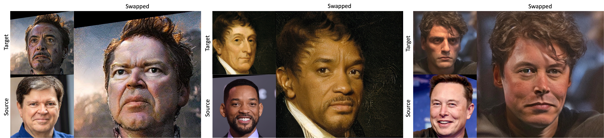

# REFace, running in the sogang mmlab environment.

This repository gives the implementation of Realistic and Efficient Face Swapping: A Unified Approach with Diffusion Models (WACV 2025)


### [Paper](https://arxiv.org/abs/2409.07269)

# REFace Setup Guide
This guide provides step-by-step instructions to set up and run the REFace project in a Docker environment.

---
## Step 1: Clone the Project

Clone the repository and navigate to the project directory:

```
git clone https://github.com/jek0407/REFace.git
cd REFace
```

## Step 2: Download Other Dependencies

Manually download the Other_dependencies folder from the shared directory:

```
\\mldisk2\nfs_shared\deepfake\REFace\Other_dependencies
```
Place the "Other_dependencies" folder in the "root" of the cloned REFace directory
```
REFace
├── assets
├── configs
├── docker-compos
├── eval_tool
├── examples
├── ldm
├── models
├── Other_dependencies
├── ...

```


## Step 3: Build the Docker Environment
Build the Docker image:

```
docker-compose build
```
This process will automatically set up the environment and download the necessary pretrained models.


## Step 4: Activate the Docker container

Run the Docker container with GPU support and map the project directory:

```
docker-compose logs -f
```

Ensure the Other_dependencies folder is placed in the root directory before building the Docker image.
The Docker build process will handle most dependencies, including downloading pretrained models.


## Step 5: Docker container 

```
docker exec -it REFace bash
```

## Prerequisites:
An NVIDIA GPU with the necessary drivers installed.
Permissions to execute Docker commands with GPU access.


## If you encounter any issues during setup:
Verify that the Other_dependencies folder is correctly placed.
Ensure Docker is properly installed and configured for GPU usage.


---

## Demo

To try our face-swapping inference on individual images using a graphical user interface, follow these steps:

```
sh Demo.sh
```
After launching, a link will be generated in the terminal. Open this link in your browser to access the GUI interface.
Use the interface to upload your source and target images. Simply select the images and click “Submit.”
Once processed, the output image will appear alongside the input images in the GUI.
Enjoy testing the Realistic and Efficient Face-Swapping (REFace) demo!


## Testing

To test our model on a dataset with facial masks (Follow dataset preparation), you can use `scripts/inference_test_bench.py`. For example, 
```
CUDA_VISIBLE_DEVICES=${device} python scripts/inference_test_bench.py \
    --outdir "${Results_dir}" \
    --config "${CONFIG}" \
    --ckpt "${CKPT}" \
    --scale 3.5 \
    --n_samples 10 \
    --device_ID ${device} \
    --dataset "CelebA" \
    --ddim_steps 50
```
or simply run:
```
sh inference_test_bench.sh
```
For a choosen folder of source and targets do faceswapping run this:
```
sh inference_selected.sh
```


## Training

### Data preparing
- Download CelebAHQ dataset

The data structure is like this:
```
dataset/FaceData
├── CelebAMask-HQ
│  ├── CelebA-HQ-img
│  │  ├── 0.png
│  │  ├── 1.png
│  │  ├── ...
│  ├── CelebA-HQ-mask
│  │  ├── Overall_mask
│  │  │   ├── 0.png
│  │  │   ├── ...
```

To create Overall mask from CelebAHQ datasets masks, simply use process_CelebA_mask.py

### Download the pretrained model of Stable Diffusion
We utilize the pretrained Stable Diffusion v1-4 as initialization, please download the pretrained models from [Hugging Face](https://huggingface.co/CompVis/stable-diffusion-v-1-4-original) and save the model to directory `pretrained_models`. Then run the following script to add zero-initialized weights for 5 additional input channels of the UNet (4 for the encoded masked-image and 1 for the mask itself).
```
python scripts/modify_checkpoints.py
```

### Training REFace
To train a new model on CelebAHQ, you can use `main_swap.py`. For example,
```
python -u main_swap.py \
--logdir models/REFace/ \
--pretrained_model pretrained_models/sd-v1-4-modified-9channel.ckpt \
--base configs/train.yaml \
--scale_lr False 
```
or simply run:
```
sh train.sh
```

## Test Benchmark
We build a test benchmark for quantitative analysis. 

To prepare FFHQ masks, run

```
python esitmate_FFHQ_mask.py --seg12
```

To get the face swapping outcomes on CelebA and FFHQ datasets run,

```
bash inference_test_bench.sh
```


## Quantitative Results


By default we assume the original dataset images, selected source, target and masks and corresponding swapped images are generated. To evaluate the face swapping in terms if FID, ID retrieval, Pose and Expression simply run:

```
bash evaluate_all.sh
```


```
@article{baliah2024realistic,
  title={Realistic and Efficient Face Swapping: A Unified Approach with Diffusion Models},
  author={Baliah, Sanoojan and Lin, Qinliang and Liao, Shengcai and Liang, Xiaodan and Khan, Muhammad Haris},
  journal={arXiv preprint arXiv:2409.07269},
  year={2024}
}
```

## Acknowledgements

This code borrows heavily from [Paint-By-Example](https://github.com/Fantasy-Studio/Paint-by-Example).


## License


This project is licensed under the MIT License. See LICENSE.txt for the full MIT license text.

Additional Notes:

Note 1: This project includes a derivative of [Paint-By-Example](https://github.com/Fantasy-Studio/Paint-by-Example) licensed under the CreativeML Open RAIL-M license. The original license terms and use-based restrictions of the CreativeML Open RAIL-M license still apply to the model and its derivatives. Please refer to https://github.com/Fantasy-Studio/Paint-by-Example?tab=License-1-ov-file for more details.

Note 2: This work includes a model that has been trained using the CelebAMask-HQ dataset. The CelebAMask-HQ dataset is available for non-commercial research purposes only. As a result, any use of this model must comply with the non-commercial usage restriction of the CelebAMask-HQ dataset. Use of this model for commercial purposes is strictly prohibited.


